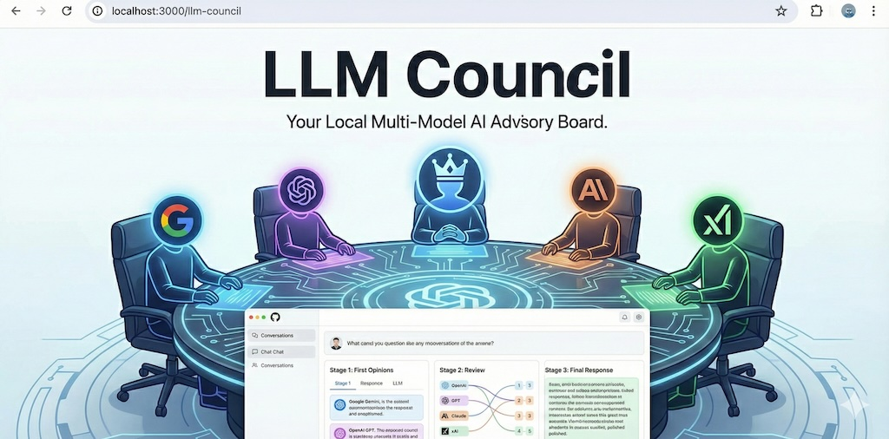

# LLM Council



The idea of this repo is that instead of asking a question to your favorite LLM provider (e.g. OpenAI GPT 5.1, Google Gemini 3.0 Pro, Anthropic Claude Sonnet 4.5, xAI Grok 4, eg.c), you can group them into your "LLM Council". This repo is a simple, local web app that essentially looks like ChatGPT except it uses OpenRouter to send your query to multiple LLMs, it then asks them to review and rank each other's work, and finally a Chairman LLM produces the final response.

In a bit more detail, here is what happens when you submit a query:

1. **Stage 1: First opinions**. The user query is given to all LLMs individually, and the responses are collected. The individual responses are shown in a "tab view", so that the user can inspect them all one by one.
2. **Stage 2: Review**. Each individual LLM is given the responses of the other LLMs. Under the hood, the LLM identities are anonymized so that the LLM can't play favorites when judging their outputs. The LLM is asked to rank them in accuracy and insight.
3. **Stage 3: Final response**. The designated Chairman of the LLM Council takes all of the model's responses and compiles them into a single final answer that is presented to the user.

## Vibe Code Alert

This project was 99% vibe coded as a fun Saturday hack because I wanted to explore and evaluate a number of LLMs side by side in the process of [reading books together with LLMs](https://x.com/karpathy/status/1990577951671509438). It's nice and useful to see multiple responses side by side, and also the cross-opinions of all LLMs on each other's outputs. I'm not going to support it in any way, it's provided here as is for other people's inspiration and I don't intend to improve it. Code is ephemeral now and libraries are over, ask your LLM to change it in whatever way you like.

## Setup

### 1. Install Dependencies

The project uses [uv](https://docs.astral.sh/uv/) for project management.

**Backend:**
```bash
uv sync
```

**Frontend:**
```bash
cd frontend
npm install
cd ..
```

### 2. Configure API Key

Create a `.env` file in the project root:

```bash
OPENROUTER_API_KEY=sk-or-v1-...
```

Get your API key at [openrouter.ai](https://openrouter.ai/). Make sure to purchase the credits you need, or sign up for automatic top up.

### 3. Configure Models (Optional)

Edit `backend/config.py` to customize the council:

```python
COUNCIL_MODELS = [
    "openai/gpt-5.1",
    "google/gemini-3-pro-preview",
    "anthropic/claude-sonnet-4.5",
    "x-ai/grok-4",
]

CHAIRMAN_MODEL = "google/gemini-3-pro-preview"
```

## Running the Application

**Option 1: Use the start script**
```bash
./start.sh
```

**Option 2: Run manually**

Terminal 1 (Backend):
```bash
uv run python -m backend.main
```

Terminal 2 (Frontend):
```bash
cd frontend
npm run dev
```

Then open http://localhost:5173 in your browser.

## Tech Stack

- **Backend:** FastAPI (Python 3.10+), async httpx, OpenRouter API
- **Frontend:** React + Vite, react-markdown for rendering
- **Storage:** JSON files in `data/conversations/`
- **Package Management:** uv for Python, npm for JavaScript
